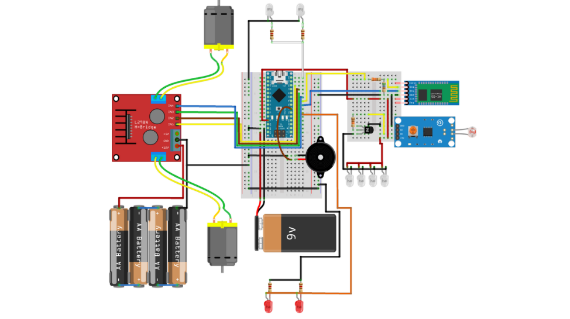
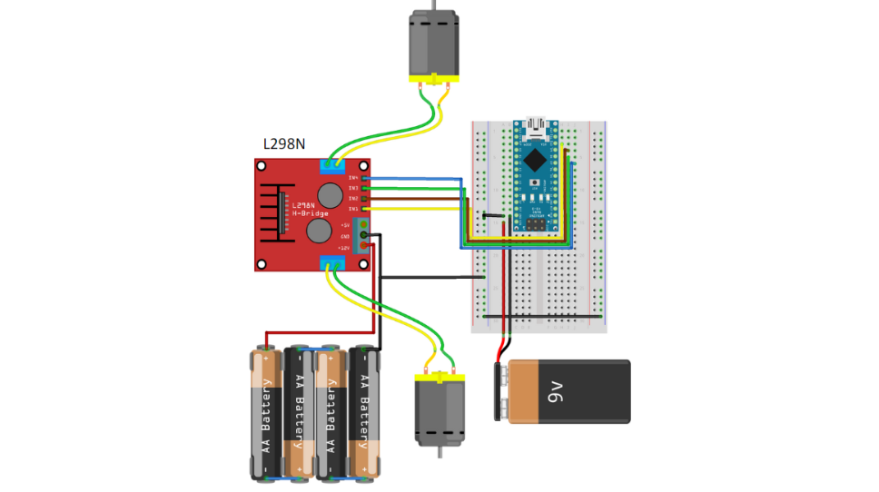
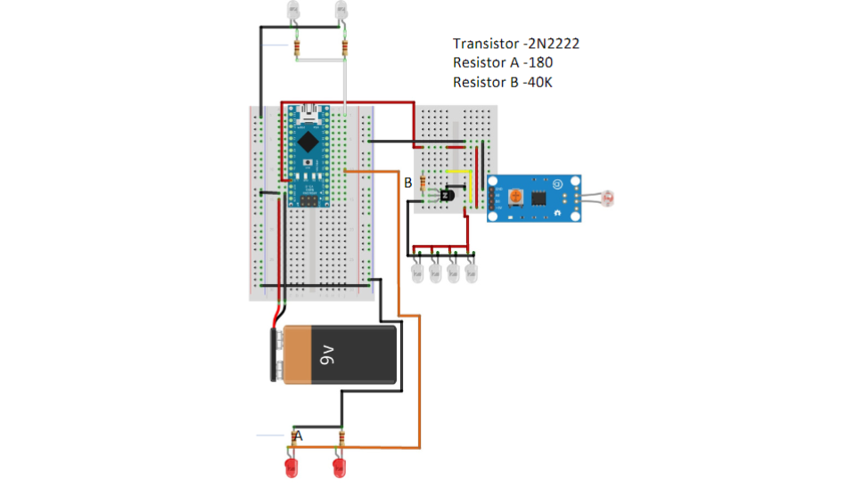
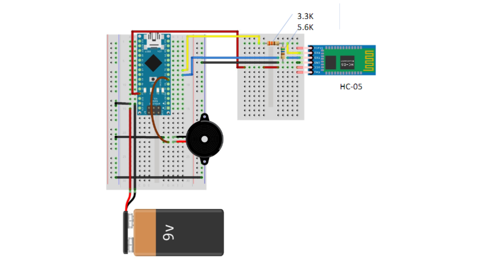
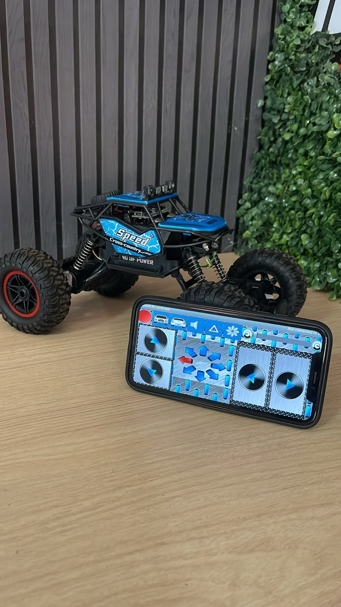
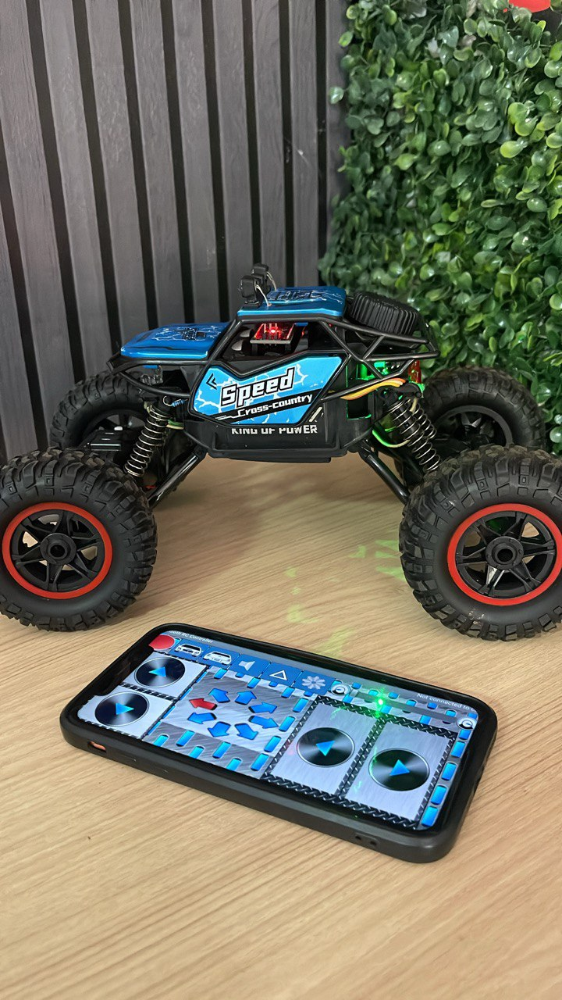
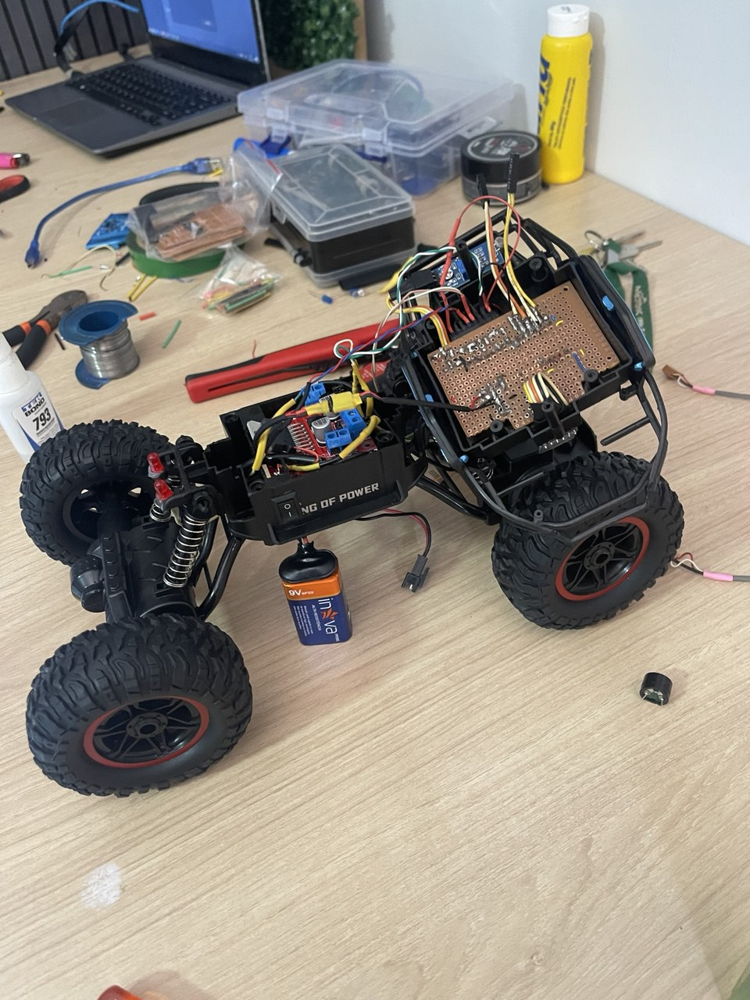
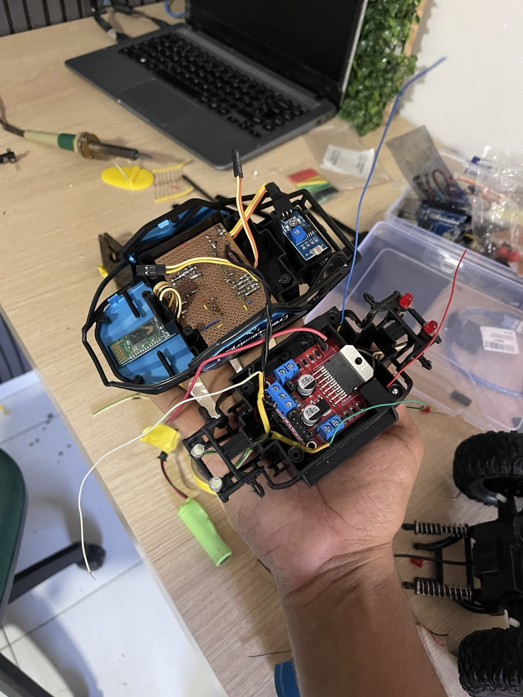
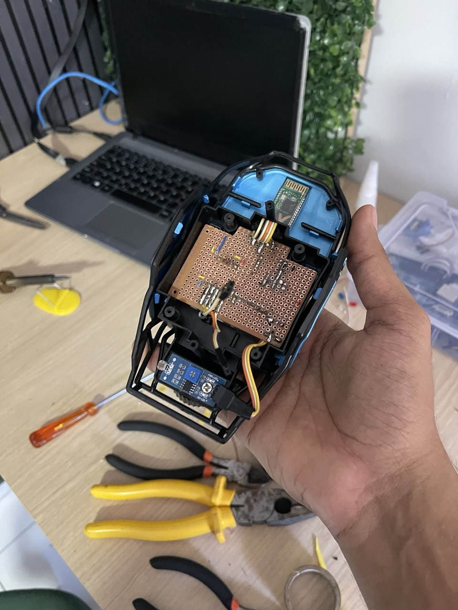

# 🚗 Wireless Car - Projeto de Microcontroladores

Este é um projeto de um carro controlado por Bluetooth utilizando Arduino Nano, desenvolvido como parte da disciplina de Microcontroladores. O carro pode ser controlado remotamente por comandos enviados via Bluetooth, permitindo movimentação, acionamento de faróis, buzina e lanternas.

## 🔧 Componentes Utilizados

- 1x Placa de PCB Ilhada  
- 1x Mini Ponte H L298N  
- 1x Módulo Bluetooth HC-05  
- 1x Arduino Nano  
- 1x Buzzer Ativo  
- 1x Módulo LDR  
- LEDs e Resistores:
  - Resistores de 220 Ohms (1 para cada LED)  
  - 1x Resistor de 3.3K Ohms  
  - 1x Resistor de 5.6K Ohms  
- Jumpers  
- 1x Transistor 2222A  

## 📦 Bibliotecas Utilizadas

- `motor.h`  
- `PiscaLed.h`  
- `SoftwareSerial.h`  

## 📲 Funcionalidades

- Controle de movimentação: frente, ré, virar para os lados e curvas.
- Controle dos faróis e lanternas.
- Buzina controlada remotamente.
- Sistema de pisca com efeito visual.

## 📡 Comandos Bluetooth

| Comando | Função                  |
|--------:|--------------------------|
| `F`     | Avançar                  |
| `B`     | Ré                       |
| `R`     | Direita                  |
| `L`     | Esquerda                 |
| `I`     | Frente + Direita         |
| `G`     | Frente + Esquerda        |
| `H`     | Ré + Esquerda            |
| `J`     | Ré + Direita             |
| `W`     | Ligar farol              |
| `w`     | Desligar farol           |
| `U`     | Ligar lanterna           |
| `u`     | Desligar lanterna        |
| `V`     | Ligar buzina             |
| `v`     | Desligar buzina          |
| `X`     | Ativar modo pisca        |
| `x`     | Desativar modo pisca     |

## ⚙️ Diagrama de Ligação

  
  
  
  

## 🧠 Lógica do Código

- Usa a biblioteca `SoftwareSerial` para comunicação com o módulo Bluetooth.
- Os comandos recebidos são tratados por meio de um `switch` no `loop()`.
- As funções de movimentação e controle de periféricos estão modularizadas.
- O modo "pisca" usa a classe `PiscaLed` para alternar LEDs com efeitos visuais.

## 📁 Estrutura do Código

O código principal está organizado da seguinte forma:

- **setup()**: Configuração inicial dos pinos, objetos e comunicação serial.
- **loop()**: Responsável pela escuta de comandos Bluetooth e execução de ações.
- **Funções auxiliares**: Controlam os motores, LEDs e buzina.

## 🚀 Como Usar

1. Monte o circuito conforme os componentes listados.
2. Faça o upload do código no Arduino Nano.
3. Emparelhe o módulo HC-05 com um celular via Bluetooth.
4. Utilize um app de terminal Bluetooth (como Serial Bluetooth Terminal) para enviar os comandos.
5. Controle o carro!

## 📷 Imagens do Projeto

  
  
   
   
   

## 🧑‍💻 Autores

Projeto desenvolvido por: Isaléo Guimarães, Gabriel Rodrigues, Kaio Alexandre, Guilherme Ruan, João Guilherme 
Curso: Ciências da Compurtação - Estácio 
Disciplina: Microcontroladores

---

**Nota:** Esse projeto pode ser expandido com sensores adicionais, controle por aplicativo, ou integração com IoT.
